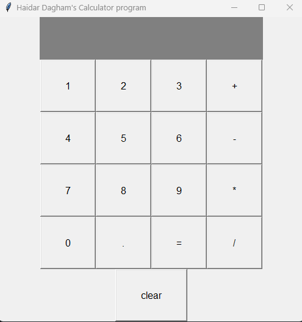

# Haidar Dagham's Calculator Program 🧮

A simple yet functional **GUI calculator** built with Python and Tkinter. This calculator supports basic arithmetic operations like addition, subtraction, multiplication, and division.

## 🖥 Features

- Responsive GUI built with Tkinter  
- Supports integers and floating-point numbers  
- Basic error handling for syntax and division errors  
- Easy to use with mouse clicks  
- Packaged as a standalone `.exe` using PyInstaller

---

## 📸 Screenshots

<p align="center">
  <strong>'Calculator Program' Desktop View</strong><br>
  
</p>

---

## 🚀 Running the Application

### 🔧 From Source (Python Script)
Make sure you have Python installed,  
then run the code file `calculator_program.py`.

### 📦 As Executable (Windows .exe)
If you've downloaded the `.exe` version:

Just double-click on `calculator_program.exe` to run the program.  
No need for Python installation.

---

### 🛠 How It Was Built

- **Language:** Python 3  
- **GUI:** Tkinter  
- **Packaged with:** PyInstaller

### 🛠 To generate the `.exe` file:

Place the `icon.ico` image and the `calculator_program.py` file in the same folder,  
then open Terminal in that folder and run the following command:

```bash
pyinstaller -F -w -i icon.ico calculator_program.py
```

---

## 📁 Files Included

- `calculator_program.py` – The main Python script  
- `calculator_program.exe` – The compiled Windows executable  
- `README.md` – This file

---

## 👨‍💻 Author
**Haidar Dagham**
